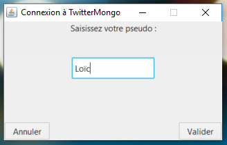
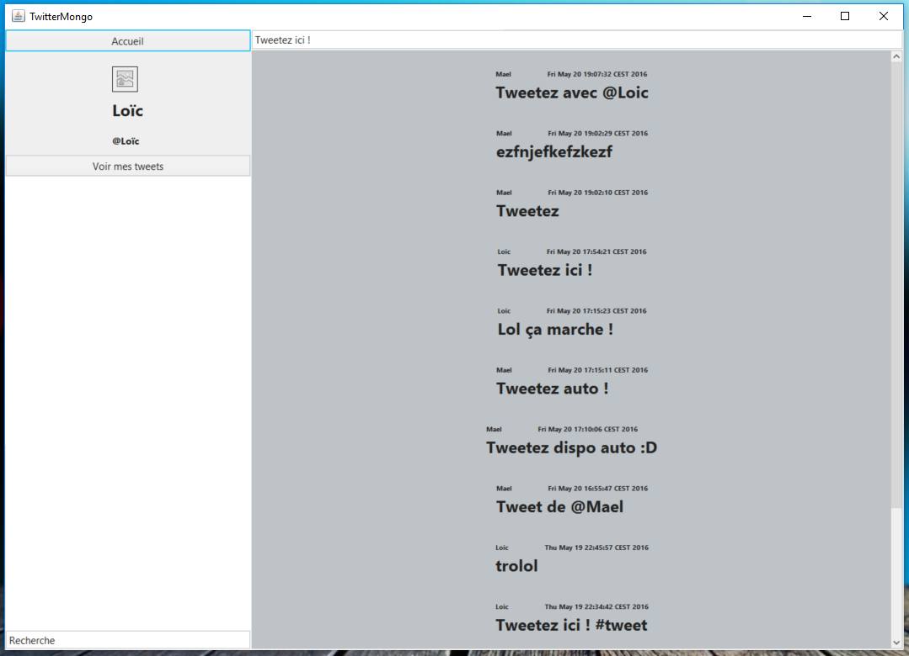
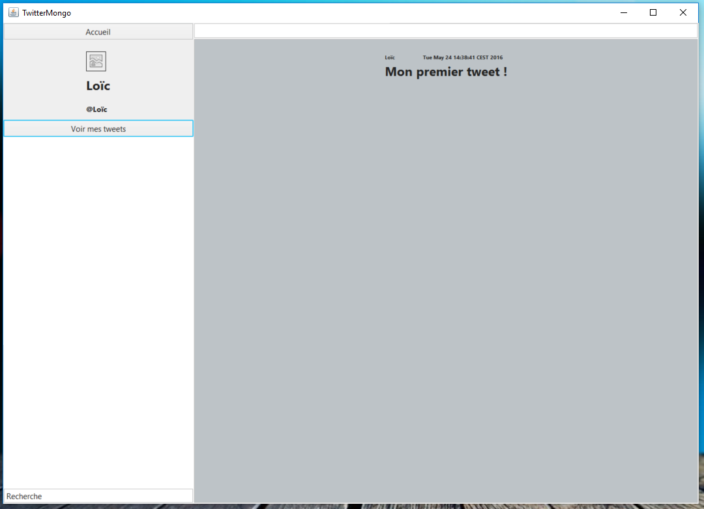
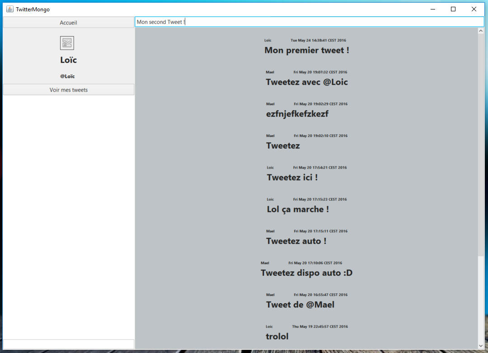
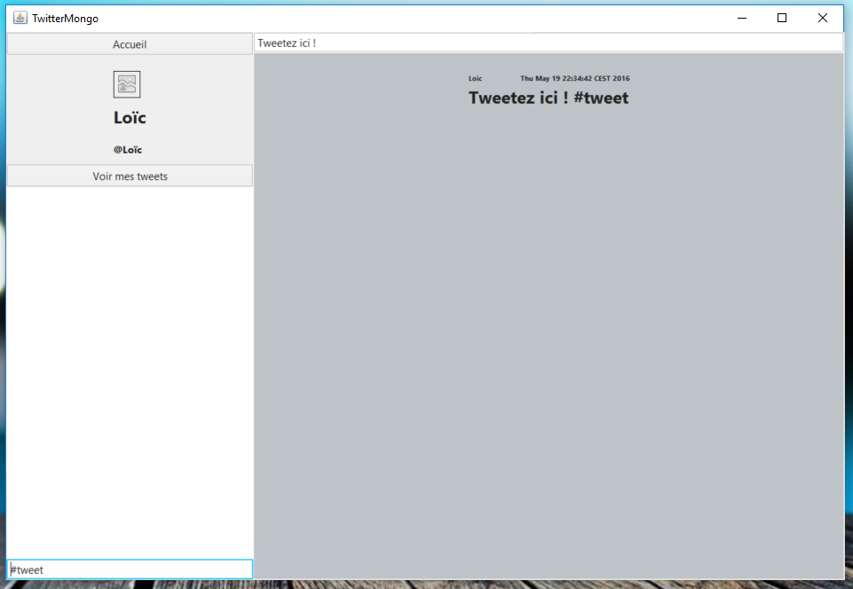
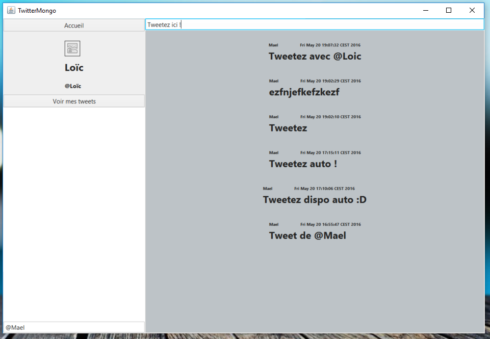

# Projet MongoDb (*TwitterLike*)

Ce répertoire est un projet Maven répondant au sujet défini ci-dessous.

## Sujet
Le projet consiste à créer un twitter like.

## Fonctionnalités et spécifications techniques

L'application doit fournir les fonctionnalités suivantes :
- Chaque utilisateur peut twitter un message (140 caractères)
- Chaque tweet peut inclure des hashtags, en le préfixant d'un '#' (#hashtag).
- Chaque tweet peut mentionner un utilisateur en préfixant son pseudo par '@' (@user).
- L'utilisateur doit pouvoir rechercher les tweets, la recherche peut se faire sur un hashtag, sur le contenu du tweet, ou sur l'auteur du tweet.
- Chaque utilisateur a une page de profil qui liste les tweets qu'il a créé, ainsi que les tweets qui le mentionnent.

La base de données doit être mongodb, le choix du langage est libre.

## Guide d'utilisation

### Mise en place et lancement du projet

Pour que l'application puisse se connecter à la base de données Mongo, il faut :
* Lancer la base de données Mongo (avec l'utilitaire `mongod.exe` sous Windows)
* Créer une base de données nommée `TwitterDb`
* Créer une collection nommée `TwitterDb`

Afin de lancer le projet, rendez-vous à la racine et exécutez la classe (dans ```TwitterLikeMongoProject/src/main/java/fr/metz/iut/louis/pedrazzani/TwitterMongo/```) en tant qu'application Java.

#### Ecran de connexion



*Ecran de connexion permettant à l'utilisateur de mettre son nom d'utlisateur*

#### Ecran principal



*Ecran d'accueil après que l'utlisateur ai renseigné son nom d'utlisateur*



*Ecran contenant les tweets de l'utilisateur*



*Ecran où l'utilisateur saisi et valide un tweet**

##### Recherche



*Ecran de recherche par le biais d'un hashtag**



*Ecran de recherche par le biais d'un arobase**

**\* : Il faut appuyer sur la touche Entrée afin de valider l'action**

### Choix techniques

Le projet se base sur l'architecture :
  * Un tweet possède son auteur
  * Un tweet est composé de 140 caractères qui contienne eventuellement des hashtags et/ou des arobases. Ce qui permet de pas lier un tableau d'hashtags et de lier plusieurs personnes à ce tweet.

Le projet est aussi basé sur l'architecture MVC (modèle/vue/controlleur) et implémentant les DAO (Objet d'Accès aux Données) afin de faire le lien entre la base et l'application.

De plus, la gestion des comptes et le sytème d'abonnements n'ont pas été implémentés car le sujet ne l'a pas demandé.
Les dépendances Maven sont celles qui ont été communiqués lors du précedent TP.

### Remarques

Le logiciel a été testé sur les plateformes Windows et Linux avec succès. L'IDE utilisé a été Eclipse.

### Contact

En cas de problème ou de demande d'informations complémentaires, veuillez-nous contacter via nos mails :
* `mael.louis@orange.fr`
* `loic.pedra@gmail.com`
